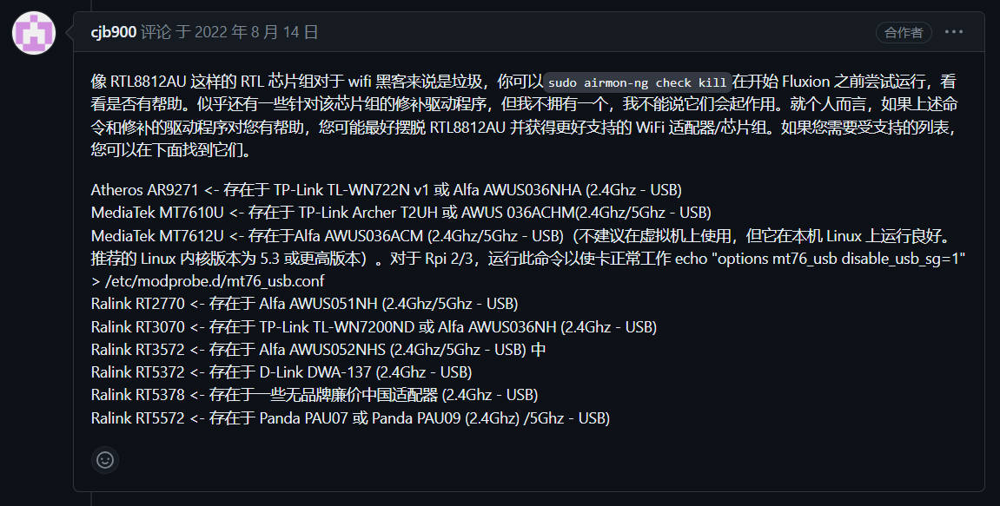
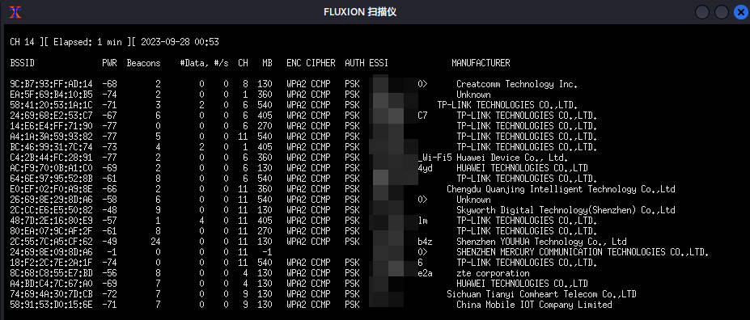
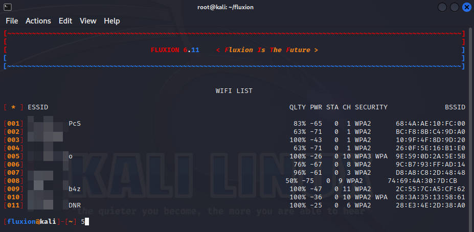
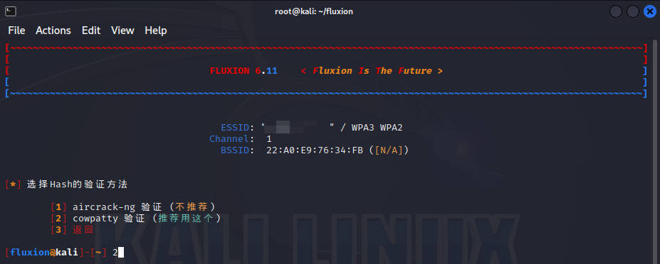
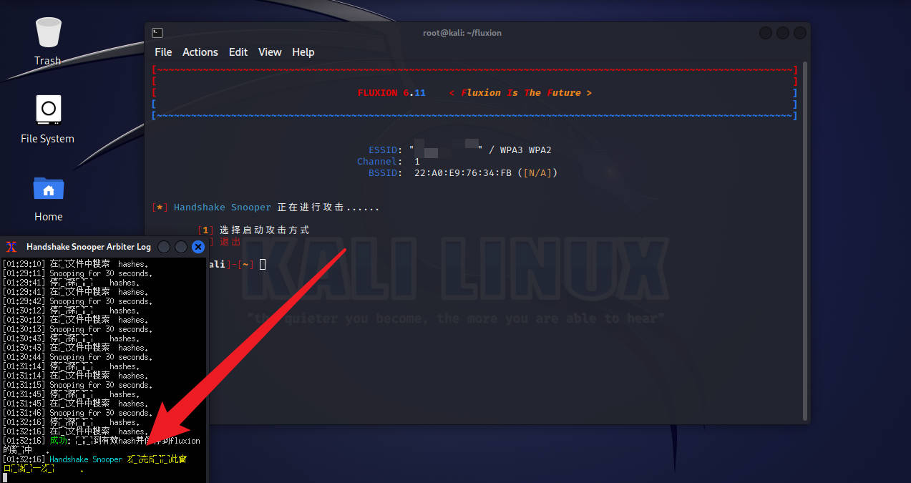
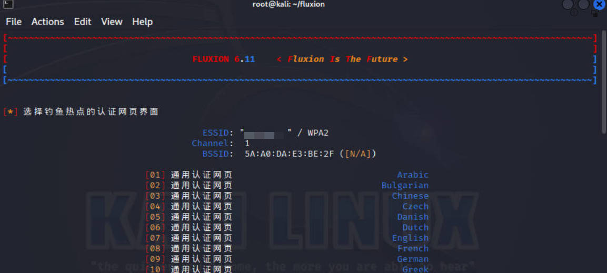
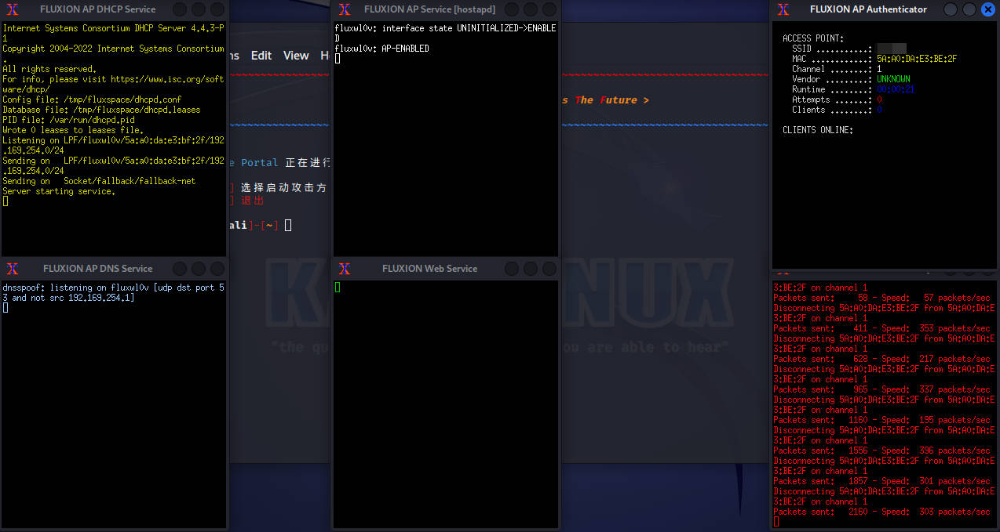
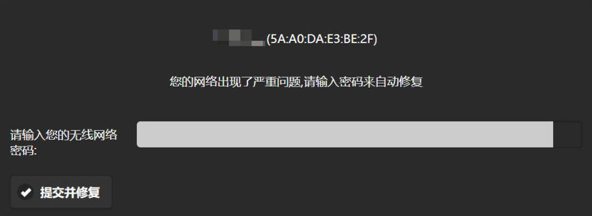
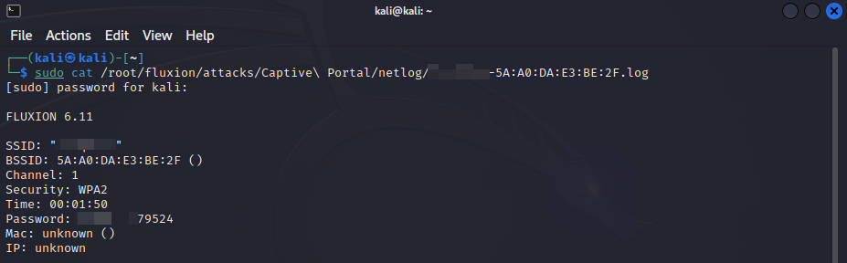

Kali Linux 使用 Fluxion 破解 WiFi 密码【WiFi 钓鱼篇】

#### 1\. **前言**

> [Fluxion](https://github.com/FluxionNetwork/fluxion) 是一种安全审计和社会工程研究工具。它是 vk496 对 linset 的重制版，（希望）错误更少，功能更多。该脚本尝试通过社会工程（网络钓鱼）攻击从目标接入点检索 WPA/WPA2 密钥。

其原理是通过阻塞原始网络并创建一个虚假的钓鱼 WiFi，诱骗用户主动输入WiFi密码。相对于暴力破解可以更快速的获取 WiFi 密码

#### 2\. 准备工作

*   Kali 免驱无线网卡

*   Kali 虚拟机或实体机

> Kali 免驱网卡可以直接在网上购买，注意问清楚商家 Kali 系统是否免驱，除了需要支持监听和注入功能，还需要支持 AP 功能（用于创建钓鱼 WiFi）。

**Fluxion 支持的无线网卡：**

> Ralink RT3070L 也是支持的，它是 3070 的升级版本，理论上支持更高的传输速率。

Kali Linux 下载地址：[https://www.kali.org/get-kali/](https://www.kali.org/get-kali/)

#### 3\. 安装 Fluxion

切换到 root 用户

    sudo -i

使用 git 命令克隆 Fluxion 项目到本地

    git clone https://www.github.com/FluxionNetwork/fluxion.git

克隆完成后进入项目文件夹

    cd fluxion

运行 Fluxion

    ./fluxion.sh

Fluxion 会自动检查缺失的依赖，如果有缺失的依赖，使用下面的命令自动安装

    ./fluxion.sh -i

#### 4\. 抓取握手包

输入 `18` 选择中文

输入 `2` 检索 WPA/WPA2 加密散列

输入 `1` 选择无线网卡（一般情况都是显示 wlan0）

输入 `3` 扫描所有信道（2.4GHz & 5GHz）

> 如果网卡不支持 5G 频段，扫描后的结果不包含 5G 频段的 WiFi

扫描到目标 WiFi 后，按 `Ctrl + C` 停止扫描

输入目标 WiFi 前面的序号（序号前面的 **0** 不需要输入）

输入 `2` 选择“跳过”

输入 `2` 选择 aireplay-ng 解除认证方式

之后全部选择推荐的选项

之后会自动抓取握手包，如果有连接到WiFi的设备，aireplay-ng 会把它踢下线，一般设备都会自动重连 WiFi，这个时候就抓取到握手包了。成功抓到握手包之后，左下角命令行会闪烁，同时显示“成功”，然后关掉这个命令行窗口就可以了

#### 5\. 创建钓鱼 WiFi

输入 `1` 选择“专属门户”

输入 `Y` 开始创建钓鱼 AP

输入 `2` 选择“跳过”

输入 `2` 选择无线网卡（一般情况都是显示 wlan0）

输入 `1` 选择 mdk4 解除认证方式

输入 `1` 选择推荐的选项

输入 `1` 选择 cowpatty 验证密码方式

输入 `1` 使用抓取到的 hash 文件

输入 `2` 选择推荐的选项

输入 `1` 创建 SSL 证书

输入 `1` 选择推荐的选项

输入 `3` 选择中文版本的通用认证网页

> 推荐根据 [官方文档](https://github.com/FluxionNetwork/fluxion/wiki/Preparing-portals-for-fluxion) 自己编写认证网页上传，因为通用的认证网页界面实在是太丑了...

之后就是等待鱼儿上钩了，钓鱼成功后右上角的窗口会显示密码保存的路径（复制这个路径，待会要用到）

当有人连接了钓鱼 WiFi，就会跳转到下面的这个认证页面，程序会比对输入密码的哈希值，输入正确的密码会自动关闭钓鱼 WiFi，并将密码保存到日志中，否则会提示密码错误

#### 6\. 查看密码

按 `Ctrl + C` 退出 Fluxion，之后输入下面的命令查看密码

    sudo cat /root/fluxion/attacks/Captive\ Portal/netlog/test-5A:A0:DA:E3:BE:2F.log

后面的路径就是上一步复制的，注意空格前面需要使用 `\` 转译

#### 7\. 总结

Fluxion 只适合距离路由器距离较近，WiFi 信号较强，并且拥有大功率无线网卡的场景，否则创建的钓鱼 WiFi 永远排在真实 WiFi 的下面，用户可能永远都不会连接这个钓鱼 WiFi，因为信号实在是太差了 XD。

如果不满足场景要求，还是推荐使用 Hashcat 进行暴力破解，详细操作请查看：

[Kali Linux 使用 Hashcat 高效破解 WiFi 密码【暴力破解篇】](https://playlab.eu.org/archives/hashcat)