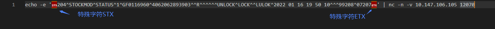

# Socket消息验证方法
模拟发送
```azure
cat xxxx.txt | nc -n -v 10.147.106.105 12070
```
* 请注意，在Master节点测试我方接口时，请内部地址。

模拟接收
```azure
nc -l 172.20.9.4 -t -p 8000
```
* 特别需要注意的是，因为不同地方编码的不同，例如下图中消息内容完整显示如下，特殊字符丢失的问题，所以上面使用测试命令将echo改为cat。

* 维基百科解释如下
### 传输控制
传输控制字符旨在构建数据流，并在面对传输错误时根据需要管理重新传输或正常失败。
标题开始 (SOH) 字符用于标记数据流的非数据部分 - 包含地址和其他内务数据的流部分。文本字符 (STX) 的开头标记了标头的结尾，以及流的文本部分的开头。文本字符的结尾 (ETX) 标记了消息数据的结尾。一个广泛使用的约定是使 ETX 前面的两个字符成为校验和或CRC，以用于错误检测。传输块结束字符 (ETB) 用于指示数据块的结束，其中数据被分成这样的块以用于传输目的。

引用链接：https://en.wikipedia.org/wiki/Control_character

客户方：
```azure
###
获取 ASCII之前添加 STX 和 ETX 作为字符。使用(char)STX 和 (char)ETX，将其添加到纯字符串数据中，然后使用System.Text.Encoding.ASCII.GetBytes到整个字符串中，以获取字节。
```