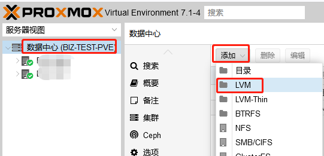
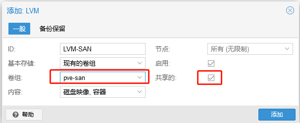
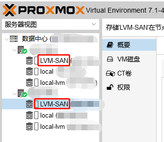

# PVE Storage - FC-SAN

### Install Dependencies
```
# apt-get update
# apt-get install multipath-tools
```
### Get WWID for the file '/etc/multipath.conf'
```
# lsblk
----------------------------------------------------------------
sdb                  8:16   0  21.8T  0 disk

# multipath -d -v3 2>/dev/null
----------------------------------------------------------------
3600507670881096af800000000000001
```

### Settings
multipath.conf
```
# We normally blacklist all devices, and only allow specific devices using 'blacklist_exceptions'
blacklist {
        wwid .*
}

blacklist_exceptions {
        wwid "3600507670881096af800000000000001"
}

# We can also use the 'alias' directive to name the device, but this is optional
multipaths {
  multipath {
        wwid "3600507670881096af800000000000001"
        alias fc-pool
  }
}

# Finally, you need reasonable defaults. We normally use the following multibus configuration (PVE 4.x and higher)
defaults {
        polling_interval        2
        path_selector           "round-robin 0"
        path_grouping_policy    multibus
        uid_attribute           ID_SERIAL
        rr_min_io               100
        failback                immediate
        no_path_retry           queue
        user_friendly_names     yes
}
```

### Add wwid
```
The wwids must also be added to the file '/etc/multipath/wwids'. To do this, run the following commands with the appropriate wwids:
# multipath -a 3600507670881096af800000000000001
```

### Restart service
```
# systemctl restart multipath-tools.service
```

### Query device status
```
# multipath -ll
----------------------------------------------------------------
fc-pool (3600507670881096af800000000000001) dm-5 INSPUR,MCS
size=22T features='1 queue_if_no_path' hwhandler='1 alua' wp=rw
|-+- policy='round-robin 0' prio=50 status=active
| |- 0:0:1:0  sdc 8:32  active ready running
| |- 16:0:1:0 sdg 8:96  active ready running
| |- 0:0:3:0  sde 8:64  active ready running
| `- 16:0:3:0 sdi 8:128 active ready running
`-+- policy='round-robin 0' prio=10 status=enabled
  |- 0:0:0:0  sdb 8:16  active ready running
  |- 16:0:0:0 sdf 8:80  active ready running
  |- 0:0:2:0  sdd 8:48  active ready running
  `- 16:0:2:0 sdh 8:112 active ready runninga
----------------------------------------------------------------
To get more information about used devices use
# ls -l /dev/mapper/
# multipath -v3
```

### physical volume initialized
```
# mkfs.ext4 /dev/mapper/fc-pool
```

### Create PV
```
# pvcreate /dev/mapper/fc-pool
```

### Create VG
```
# vgcreate pve-san /dev/mapper/fc-pool
```
### Create Cluster Shared Storage
```
login website 
https://node ip:8006
```






### Performance test with fio
fio --filename=/dev/mapper/fc-pool --direct=1 --rw=read --bs=1m --size=20G --numjobs=200 --runtime=60 --group_reporting --name=file1