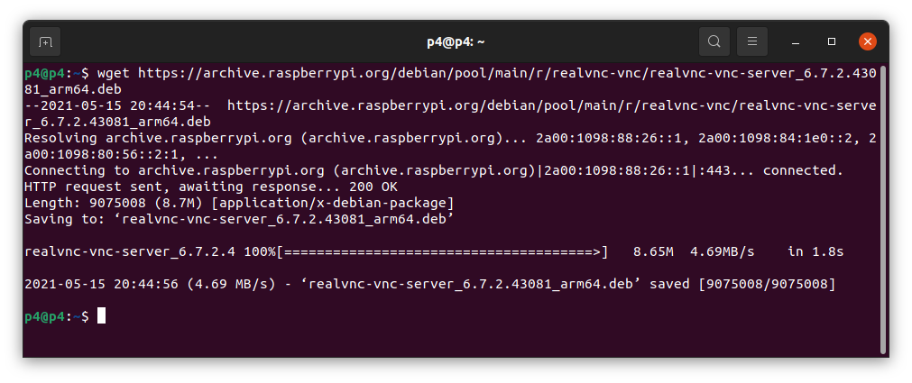
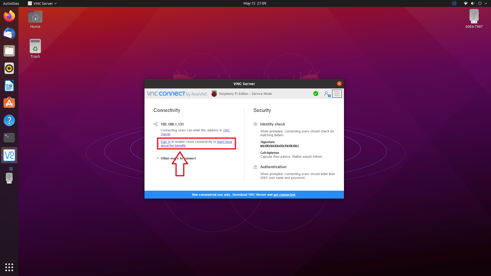
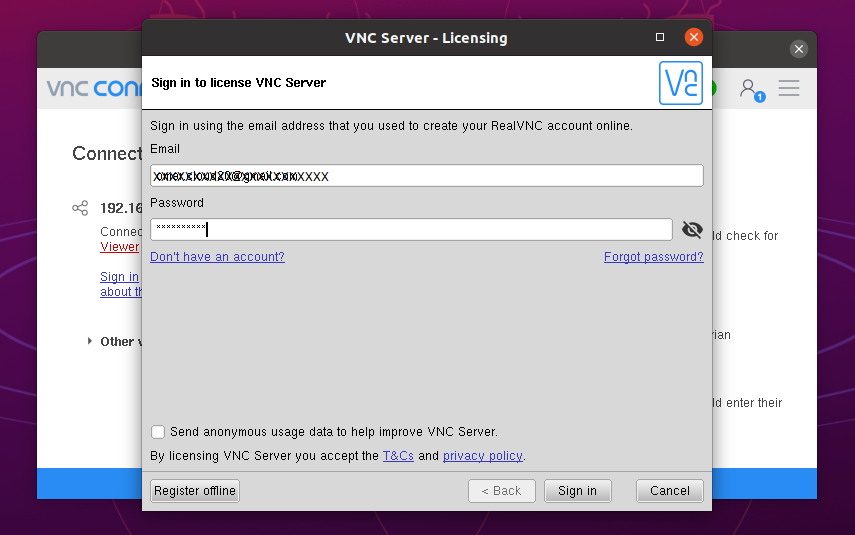
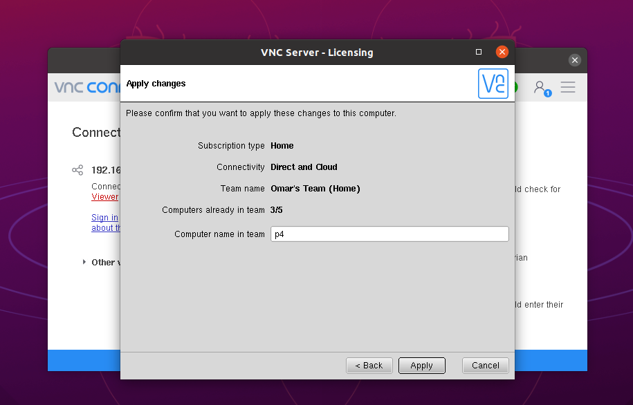
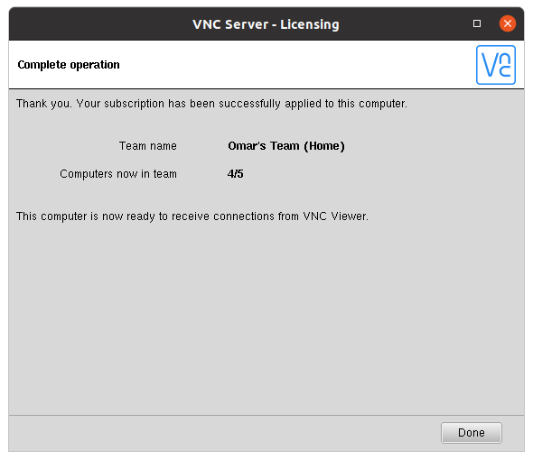
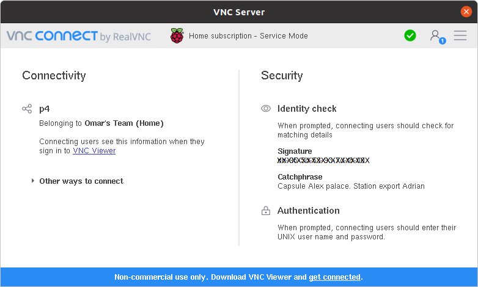
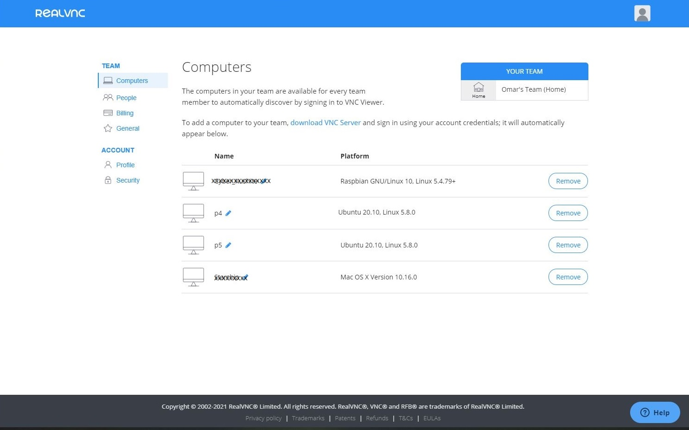
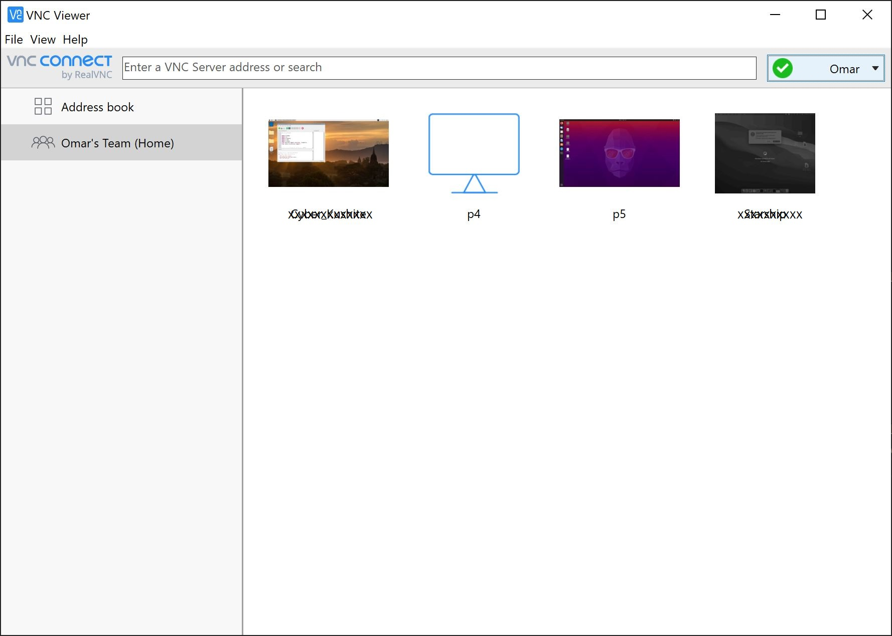
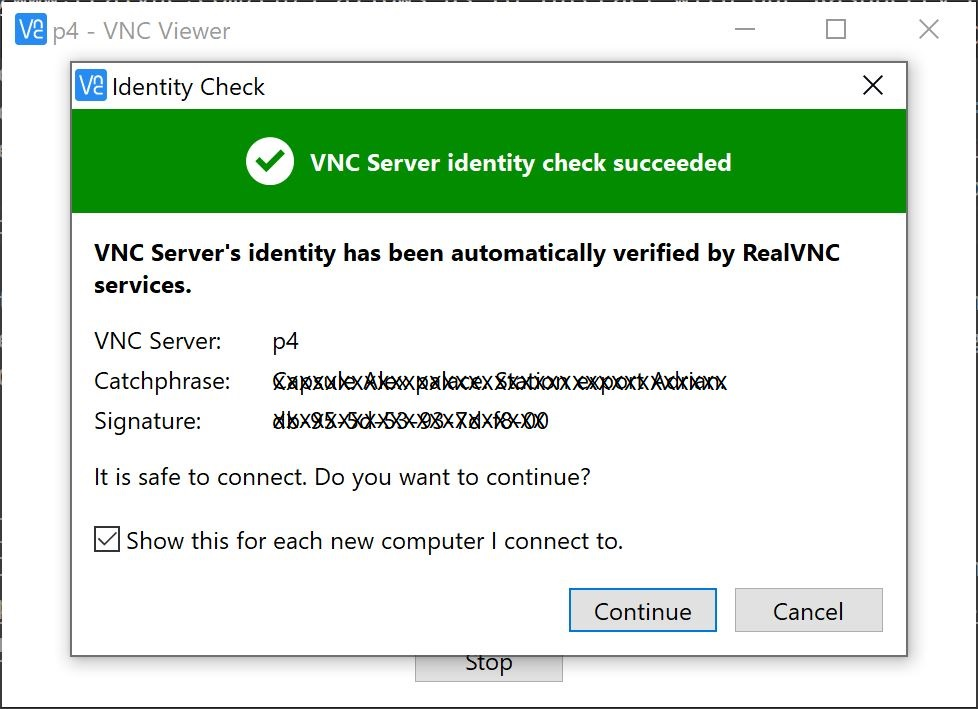
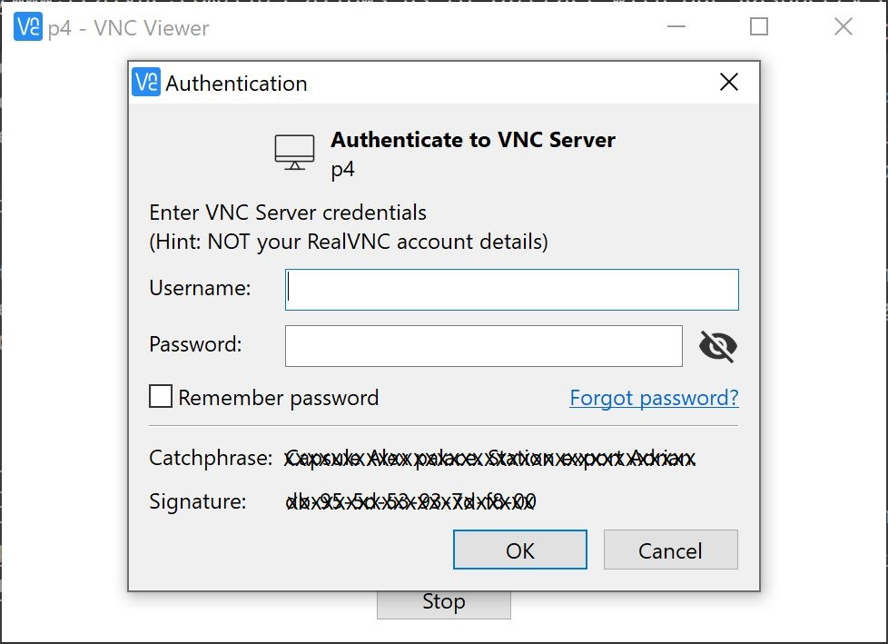

# Install RealVNC Server on Ubuntu 20.04 for Remote Access - Learn With Omar
What is a RealVNC Server?
-------------------------

[RealVNC](https://www.realvnc.com/en/) allows us to interact with our Raspberry Pis graphically via **Virtual Network Computing (VNC)**. The RealVNC server comes preinstalled with the [Raspberry Pi OS](https://www.raspberrypi.org/software/). It’s extremely secure, convenient and reliable. Until the moment of writing this tutorial, 5/15/2021, RealVNC allows us to have up to 5 subscribed devices to remote into via **cloud** connectivity for **FREE**. By using this feature, we can remote into our devices from anywhere in the world without a VPN, a port-forwarding or a firewall configuration. If you’d like to subscribe more devices, it won’t be covered under the free subscription plan. However, you could access more devices from within the local network using **direct** feature.

Since we have installed Ubuntu, which is a 64bit-OS, on our RPI-4, and RealVNC only provides a 32bit server for Raspberry Pi OS, we will need to go through some hoops to get RealVNC installed and running. During this tutorial, I will go over how to install RealVNC on Ubuntu 20.04 LTS.

I have successfully installed and tested RealVNC based on multiple resources such, [resource 1](https://www.raspberrypi.org/forums/viewtopic.php?t=288769%5B%5D(https://www.raspberrypi.org/forums/viewtopic.php?t=288769)) and [resource 2](https://github.com/mtbiker-s/ubuntu20.10-rpi-install-vnc).

Step 1: Install RealVNC Server on our Ubuntu 20.04 LTS
------------------------------------------------------

Let’s navigate to our terminal. As a best practice, we shall update and upgrade our operating system.

```
sudo apt update && sudo apt upgrade -y
sudo apt install libcanberra-gtk-module libcanberra-gtk3-module libraspberrypi-dev

```


Let’s download the **arm64** package from [the Raspberry Pi Foundation’s site](https://archive.raspberrypi.org/debian/pool/main/r/realvnc-vnc/) using the following command.

```
wget https://archive.raspberrypi.org/debian/pool/main/r/realvnc-vnc/realvnc-vnc-server_7.5.1.50075_arm64.deb

```




Now, we will install the package using **dpkg** command:

```
sudo dpkg -i realvnc-vnc-server_7.5.1.50075_arm64.deb

```


Here, we will add specific files to **/user/lib/** folder, so let **cd** into it:

```
cd /usr/lib/aarch64-linux-gnu

```


Let’s add the following 10 files to the folder:

```
sudo ln libvcos.so /usr/lib/libvcos.so.0
sudo ln libvchiq_arm.so /usr/lib/libvchiq_arm.so.0
sudo ln libbcm_host.so /usr/lib/libbcm_host.so.0
sudo ln libmmal.so /usr/lib/libmmal.so.0
sudo ln libmmal_core.so /usr/lib/libmmal_core.so.0
sudo ln libmmal_components.so /usr/lib/libmmal_components.so.0
sudo ln libmmal_util.so /usr/lib/libmmal_util.so.0
sudo ln libmmal_vc_client.so /usr/lib/libmmal_vc_client.so.0
sudo ln libvcsm.so /usr/lib/libvcsm.so.0
sudo ln libcontainers.so /usr/lib/libcontainers.so.0

```


Finally, let’s enable and start the following services:

```
sudo systemctl enable vncserver-virtuald.service
sudo systemctl enable vncserver-x11-serviced.service
sudo systemctl start vncserver-virtuald.service
sudo systemctl start vncserver-x11-serviced.service

```


Let’s reboot our Raspberry Pi for these changes to take effect.

```
sudo reboot

```


_Note: if RealVNC server GUI has not started automatically, follow the following steps._ On the default display manager, select **lightdm**.

```
sudo apt-get install lightdm

```


```
sudo reboot

```


This installation will also work on Ubuntu 20.10 as well.

Step 2: Signup for a Free RealVNC Team’s Account
------------------------------------------------

1.  Signup for a free [RealVNC Team’s Account](https://manage.realvnc.com/).

2.  On your RPI-4, signin with your credentials to add this RPI-4 to your Computers' account.






_Notice, the **Connectivity** is Direct and Cloud._ 

Now, your RPI-4 is ready to receive a secured VNC connection whether it’s a direct or cloud connection.

 

3.  To manage your devices, navigate to Computers under **TEAM** on your profile page and you shall see all subscribed devices to **Cloud**. Remember, you may only add up to 5 devices using the free subscription.



Step 3: Install RealVNC Viewer
------------------------------

Now, we have successfully installed RealVNC server, signup for an account and subscribed our device, we will need a method to remote into our RPI-4. Navigate to [RealVNC](https://www.realvnc.com/en/connect/download/viewer/) to download a VNC Viewer to your viewer device. This could be your iPhone, Android phone, Mac Pro or your Windows machine.

1.  After installing the VNC Viewer, signin with your credentials and you shall see all subscribed devices for **cloud** connection automatically. You may also add **direct** connection device on the **Address book** section.



2.  Double click on your RPI-4, in my case it’s **p4**. Click on Continue.



3.  Enter your RPI-4’s username and password to connect via VNC. These are the credentials you’re using to signin into your RPI-4.



### Conclusion:

This concludes our RealVNC server installation on a Ubuntu 20.04 LTS (or 20.10) on a RPI 4. We have successfully installed and configured RealVNC server on our RPI-4 arm64. Moreover, we have installed RealVNC Viewer and established a cloud VNC connection securely to our RPI-4. Cheers!